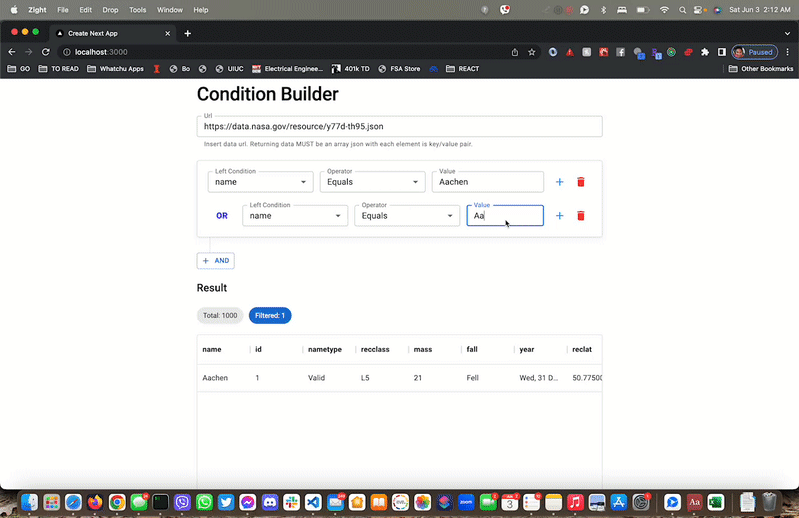
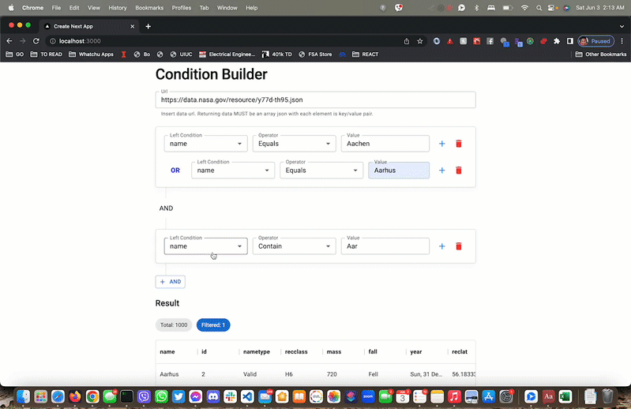

## Getting Started

First, make sure you have the correct Node version. If you have `nvm`, you can run `nvm use` to temporarily update your node version with the latest in the .nvmrc file.

Then, install the dependencies with `npm i`.

Run the development server:

```bash
npm run dev
```

Open [http://localhost:3000](http://localhost:3000) with your browser to see the result.

Run storybook:

```bash
npm run storybook
```

Open [http://localhost:6006](http://localhost:6006) to see the components.

## Assumptions

In real life, I may have asked the following questions before jumping in.

- Is there a limit on the number of conditions that a user can make?
- Do you have test cases available?

In the interest of time and since we do not have a physical person to ask, I made the following assumptions.

- Users can add an infinite number of conditions, OR and AND conditions. This adds more complexity in the code. It will vastly simplify the code if we have a limit on the number of conditions.
- Spaces, font, colors and stylings. Styles may be slightly off in the absence of a Figma spec. Designers usually spec out the screens upto the last pixel in Figma. For a good design, developers simply copy the stylesheet.

## Improvements

- Responsive design - just needs mobile spec. Ideally, it will be easier if we use a mobile first approach during development.
- We can also add a feature flag so that we can commit our half baked features anytime.
- Cypress tests for end-to-end test. Right now, I am mocking API calls with msw. With Cypress, you can test different data with different API calls.
- We can use React Query to further improve our caching and state management.

## Demo

I implemented all the features, including the two bonus points. I used component driven development, wherein I started with the smallest components first (`./src/components/atomic/*`) then slowly building from the bottom up (`./src/components/composite` -> `./src/components/pages`).

I decided to wrap MUI with my own component library to make it cleaner. It will also make it easier for us to update our own components and have more control (i.e. we decided to use Semantic UI instead of MUI, or remove dependency to MUI for some components, etc).




